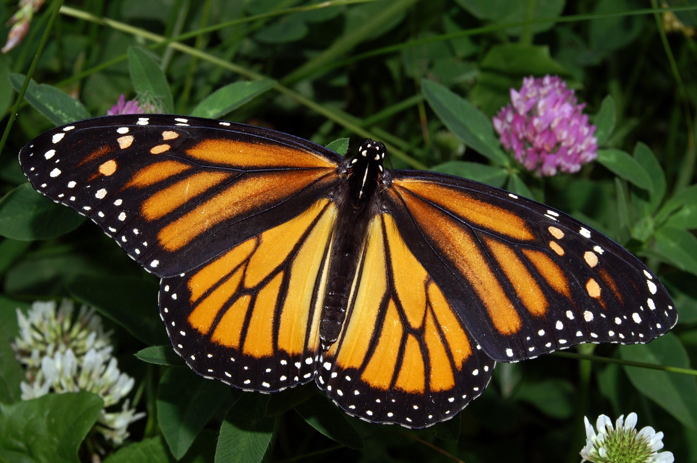

# Image Processing Tool: A Comprehensive Command-Line Application

This report provides an overview and detailed explanation of the Image Processing Tool, designed as a command-line application. The tool implements several essential image processing functionalities, including image compression, noise reduction, edge detection, contrast correction, segmentation, thresholding, morphological operations, and image repair.

## Table of Contents
1. [Introduction](#introduction)
2. [Project Structure](#project-structure)
3. [Functionalities](#functionalities)
    - [Image Compression](#image-compression)
    - [Noise Reduction](#noise-reduction)
    - [Edge Detection](#edge-detection)
    - [Contrast Correction](#contrast-correction)
    - [Segmentation](#segmentation)
    - [Thresholding](#thresholding)
    - [Morphology](#morphology)
    - [Image Repair](#image-repair)
4. [Usage Instructions](#usage-instructions)
5. [Implementation Details](#implementation-details)
6. [Conclusion](#conclusion)

## Introduction

This project aims to create a comprehensive image processing tool that can be run from the command line. The tool supports multiple image processing operations, each of which can be executed individually, and the results can be saved as separate output files. This report provides an in-depth look at the tool's structure, functionalities, and usage.

## Project Structure

The project is organized into the following files:

```
image_processing_tool/
├── main.py
├── compression.py
├── noise_reduction.py
├── edge_detection.py
├── contrast_correction.py
├── segmentation.py
├── thresholding.py
├── morphology.py
├── image_repair.py
├── utils.py
└── requirements.txt
```

### Description of Files

- **main.py**: The main script to run the application.
- **compression.py**: Handles image compression.
- **noise_reduction.py**: Implements noise reduction techniques.
- **edge_detection.py**: Contains edge detection methods.
- **contrast_correction.py**: Adjusts image contrast.
- **segmentation.py**: Performs image segmentation.
- **thresholding.py**: Applies thresholding operations.
- **morphology.py**: Implements morphological operations.
- **image_repair.py**: Repairs the image using masks.
- **utils.py**: Utility functions for parsing arguments, saving images, and resizing masks.
- **requirements.txt**: Lists the dependencies required for the project.

## Functionalities

### Image Compression

**File**: `compression.py`

The `compress_image` function compresses an image by adjusting its quality. This reduces the file size while maintaining visual fidelity.

```python
import cv2

def compress_image(image, quality=90):
    encode_param = [int(cv2.IMWRITE_JPEG_QUALITY), quality]
    result, encimg = cv2.imencode('.jpg', image, encode_param)
    if result:
        image = cv2.imdecode(encimg, 1)
    return image
```

 

### Noise Reduction

**File**: `noise_reduction.py`

The `reduce_noise` function offers multiple methods for noise reduction, including Gaussian blur, median blur, and bilateral filtering.

```python
import cv2

def reduce_noise(image, method='gaussian', ksize=5):
    if method == 'gaussian':
        return cv2.GaussianBlur(image, (ksize, ksize), 0)
    elif method == 'median':
        return cv2.medianBlur(image, ksize)
    elif method == 'bilateral':
        return cv2.bilateralFilter(image, ksize, 75, 75)
    else:
        raise ValueError("Unsupported noise reduction method")
```

 

### Edge Detection

**File**: `edge_detection.py`

The `detect_edges` function supports edge detection using methods like Canny and Sobel.

```python
import cv2

def detect_edges(image, method='canny', low_threshold=50, high_threshold=150):
    if method == 'canny':
        return cv2.Canny(image, low_threshold, high_threshold)
    elif method == 'sobel':
        grad_x = cv2.Sobel(image, cv2.CV_16S, 1, 0)
        grad_y = cv2.Sobel(image, cv2.CV_16S, 0, 1)
        abs_grad_x = cv2.convertScaleAbs(grad_x)
        abs_grad_y = cv2.convertScaleAbs(grad_y)
        return cv2.addWeighted(abs_grad_x, 0.5, abs_grad_y, 0.5, 0)
    else:
        raise ValueError("Unsupported edge detection method")
```
 

### Contrast Correction

**File**: `contrast_correction.py`

The `correct_contrast` function enhances the image contrast using CLAHE (Contrast Limited Adaptive Histogram Equalization).

```python
import cv2
import numpy as np

def correct_contrast(image, clip_limit=2.0, tile_grid_size=(8, 8)):
    lab = cv2.cvtColor(image, cv2.COLOR_BGR2LAB)
    l, a, b = cv2.split(lab)
    clahe = cv2.createCLAHE(clipLimit=clip_limit, tileGridSize=tile_grid_size)
    cl = clahe.apply(l)
    limg = cv2.merge((cl, a, b))
    return cv2.cvtColor(limg, cv2.COLOR_LAB2BGR)
```
 

### Segmentation

**File**: `segmentation.py`

The `segment_image` function segments the image into clusters using K-means clustering.

```python
import cv2
import numpy as np

def segment_image(image, k=2):
    Z = image.reshape((-1, 3))
    Z = np.float32(Z)
    criteria = (cv2.TERM_CRITERIA_EPS + cv2.TERM_CRITERIA_MAX_ITER, 10, 1.0)
    ret, label, center = cv2.kmeans(Z, k, None, criteria, 10, cv2.KMEANS_RANDOM_CENTERS)
    center = np.uint8(center)
    res = center[label.flatten()]
    return res.reshape((image.shape))
```

 

### Thresholding

**File**: `thresholding.py`

The `apply_threshold` function applies various thresholding techniques such as binary, Otsu's, and adaptive thresholding.

```python
import cv2

def apply_threshold(image, method='binary', thresh=127, maxval=255):
    gray = cv2.cvtColor(image, cv2.COLOR_BGR2GRAY)
    if method == 'binary':
        ret, thresh_img = cv2.threshold(gray, thresh, maxval, cv2.THRESH_BINARY)
    elif method == 'otsu':
        ret, thresh_img = cv2.threshold(gray, 0, maxval, cv2.THRESH_BINARY + cv2.THRESH_OTSU)
    elif method == 'adaptive':
        thresh_img = cv2.adaptiveThreshold(gray, maxval, cv2.ADAPTIVE_THRESH_GAUSSIAN_C, cv2.THRESH_BINARY, 11, 2)
    else:
        raise ValueError("Unsupported thresholding method")
    return thresh_img
```
 

### Morphology

**File**: `morphology.py`

The `apply_morphology` function performs morphological operations such as dilation, erosion, opening, and closing.

```python
import cv2

def apply_morphology(image, operation='dilate', kernel_size=(5, 5)):
    kernel = cv2.getStructuringElement(cv2.MORPH_RECT, kernel_size)
    if operation == 'dilate':
        return cv2.dilate(image, kernel, iterations=1)
    elif operation == 'erode':
        return cv2.erode(image, kernel, iterations=1)
    elif operation == 'open':
        return cv2.morphologyEx(image, cv2.MORPH_OPEN, kernel)
    elif operation == 'close':
        return cv2.morphologyEx(image, cv2.MORPH_CLOSE, kernel)
    else:
        raise ValueError("Unsupported morphological operation")
```

 

- **Dilation:**

    

- **Erosion:**

    


- **Opening:**

        

- **Closing:**

    


### Image Repair

**File**: `image_repair.py`

The `repair_image` function repairs the image using inpainting techniques. If no mask is provided, a default mask is created, and if the mask size differs from the input image, it is resized accordingly.

```python
import cv2
import numpy as np
from utils import resize_to_match

def create_default_mask(image):
    mask = np.zeros(image.shape[:2], dtype=np.uint8)
    h, w = image.shape[:2]
    mask[h//4:h//4*3, w//4:w//4*3] = 255
    return mask

def repair_image(image, method='inpaint', mask=None):
    if mask is None:
        mask = create_default_mask(image)
    else:
        if mask.shape[:2] != image.shape[:2]:
            mask = resize_to_match(image, mask)
    if method == 'inpaint':
        return cv2.inpaint(image, mask, 3, cv2.INPAINT_TELEA)
    else:
        raise ValueError("Unsupported repair method")
```

   

## Usage Instructions

1. **Install dependencies**:
    ```sh
    pip install -r requirements.txt
    ```

2. **Run the application**:
    ```sh
    python main.py input_image.jpg output_directory --compress --noise --edge --contrast --segment --threshold --morphology --repair --mask path_to_mask_image
    ```

## Implementation Details

### main.py

The `main.py` script orchestrates the entire process. It reads the input image, applies the selected operations, and saves the results.

```python
import cv2
from compression import compress_image
from noise_reduction import reduce_noise
from edge_detection import detect_edges
from contrast_correction import correct_contrast
from segmentation import segment_image
from thresholding import apply_threshold
from morphology import apply_morphology
from image_repair import repair_image
from utils import parse_arguments, save_image

def main():
    args = parse_arguments()
    image = cv2.imread(args.input)
    
    if args.compress:
        compressed_image = compress_image(image)
        save_image(args.output_dir, 'compress', compressed_image)
    if args.noise:
        noise_reduced_image = reduce_noise(image)
        save_image(args.output_dir, 'noise_reduction', noise_reduced_image)
    if args.edge:
        edge_detected_image = detect_edges(image)
        save_image(args.output_dir, 'edge_detection', edge_detected_image)
    if args.contrast:
        contrast_corrected_image = correct_contrast(image)
        save_image(args.output_dir, 'contrast_correction', contrast_corrected_image)
    if args.segment:
        segmented_image = segment_image(image)
        save_image(args.output_dir, 'segmentation', segmented_image)
    if args.threshold:
        thresholded_image = apply_threshold(image)
        save_image(args.output_dir, 'thresholding', thresholded_image)
    if args.morphology:
        morphology_image = apply_morphology(image)
        save_image(args.output_dir, 'morphology', morphology_image)
    if args.repair:
        mask = cv2.imread(args.mask, 0) if args.mask else None
        repaired_image = repair_image(image, mask=mask)
        save_image(args.output_dir, 'repair', repaired_image)

if __name__ == "__main__":
    main()
```

### utils.py

This file contains utility functions for parsing arguments, saving images, and resizing masks.

```python
import argparse
import cv2
import os

def parse_arguments():
    parser = argparse.ArgumentParser(description='Image Processing Tool')
    parser.add_argument('input', type=str, help='Path to the input image')
    parser.add_argument('output_dir', type=str, help='Directory to save the output images')
    parser.add_argument('--compress', action='store_true', help='Compress the image')
    parser.add_argument('--noise', action='store_true', help='Reduce noise in the image')
    parser.add_argument('--edge', action='store_true', help='Detect edges in the image')
    parser.add_argument('--contrast', action='store_true', help='Correct contrast of the image')
    parser.add_argument('--segment', action='store_true', help='Segment the image')
    parser.add_argument('--threshold', action='store_true', help='Apply thresholding to the image')
    parser.add_argument('--morphology', action='store_true', help='Apply morphological operations to the image')
    parser.add_argument('--repair', action='store_true', help='Repair the image')
    parser.add_argument('--mask', type=str, help='Path to the mask image for repair (optional)')
    return parser.parse_args()

def save_image(output_dir, operation, image):
    output_path = os.path.join(output_dir, f"{operation}.jpg")
    cv2.imwrite(output_path, image)
    print(f"{operation.capitalize()} image saved at {output_path}")

def resize_to_match(image, mask):
    return cv2.resize(mask, (image.shape[1], image.shape[0]))
```

## Conclusion

This project provides a versatile and user-friendly command-line tool for performing various image processing operations. Each functionality is implemented in a modular fashion, allowing for easy maintenance and extension.
